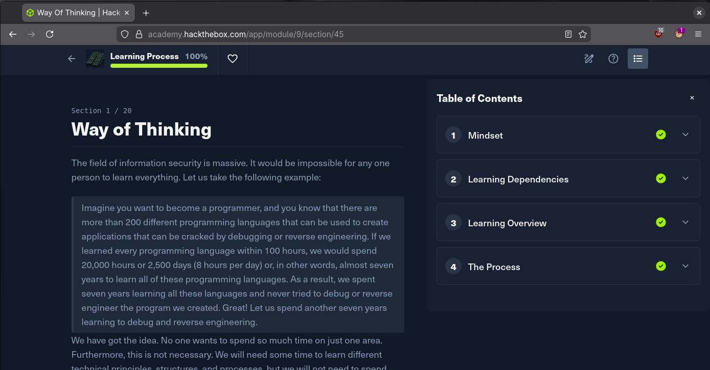
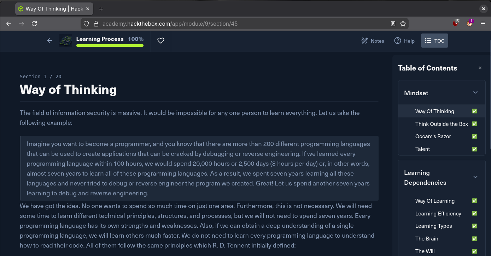
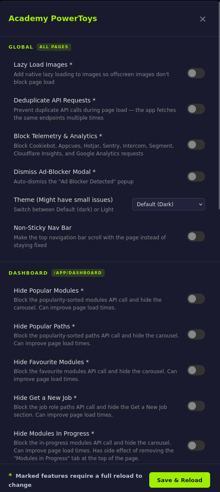
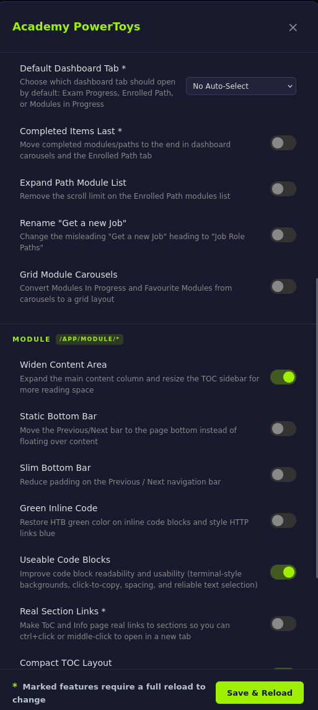
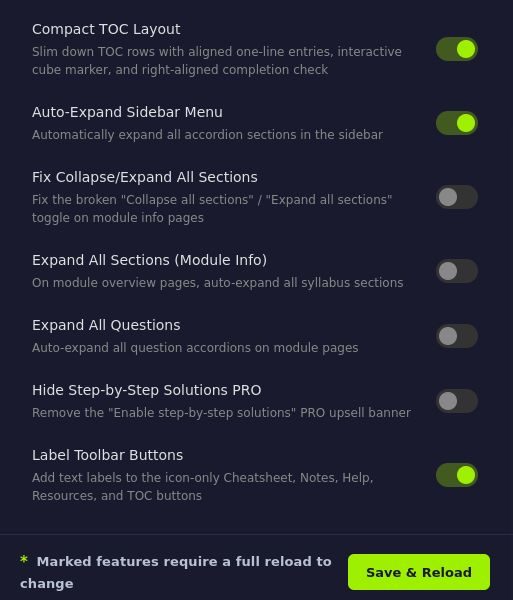

# Academy PowerToys

Unofficial power-user enhancements for [HTB Academy](https://academy.hackthebox.com). No affiliation with Hack The Box.

## Troubleshooting First

If HTB Academy behaves oddly, disable Academy PowerToys and retest before contacting HTB support or reporting a site bug to avoid unnecessary support tickets.

1. Disable the userscript in your script manager.
2. Hard refresh HTB Academy and reproduce the issue.
3. If the issue is gone, it is likely script-related.
4. If the issue remains with the script disabled, it is likely an HTB-side issue.

## Install

1. Install [Violentmonkey](https://violentmonkey.github.io/), Tampermonkey, or Greasemonkey
2. Grab the latest `academy-powertoys.user.js` from [Releases](../../releases)

   Or to let your user script update it with [this](https://github.com/botnetbuddies/academy-powertoys/releases/latest/download/academy-powertoys.user.js) link
3. Open it — your userscript manager will prompt to install

## Example Showcase

### Before / After

<p>
  
  
</p>

### Menu Options

<p>
  
  
  
</p>

## Development

The source lives in `src/` as separate modules. A build script concatenates them into a single `.user.js` file.

```
src/
  header.js / footer.js        # IIFE wrapper + userscript metadata
  core/                         # registry, settings manager, scope detection
  features/
    early/                      # run at document-start (before DOM)
    global/                     # run on all pages
    dashboard/                  # run on /app/dashboard
    module/                     # run on /app/module/*
  ui/                           # settings panel + floating gear button
  runner.js                     # feature runner + init
```

### Build

```sh
./build.sh          # uses version from package.json
./build.sh 1.2.3    # explicit version
```

Output: `academy-powertoys.user.js` (gitignored — don't commit it).

### Adding a feature

1. Create `src/features/{scope}/my-feature.js` where scope is `early`, `global`, `dashboard`, or `module`
2. Add a `registerFeature()` call:

```js
  registerFeature({
    id: 'my-feature',
    label: 'My Feature',
    description: 'What it does',
    scope: 'module',        // 'global' | 'dashboard' | 'module'
    default: true,           // enabled out of the box?
    // early: true,          // uncomment to run before DOM ready
    // settings: { ... },    // optional sub-settings with defaults
    run(cfg) {
      // your code here — cfg contains merged settings
    },
  });
```

3. Add your file to the `FILES` array in `build.sh` (order matters for early features)
4. Run `./build.sh` and test

The settings panel toggle is automatic — no UI code needed.

### Releasing

Push a version tag and CI builds + publishes a GitHub Release:

```sh
git tag v1.1.0
git push --tags
```

## License

Unlicense
